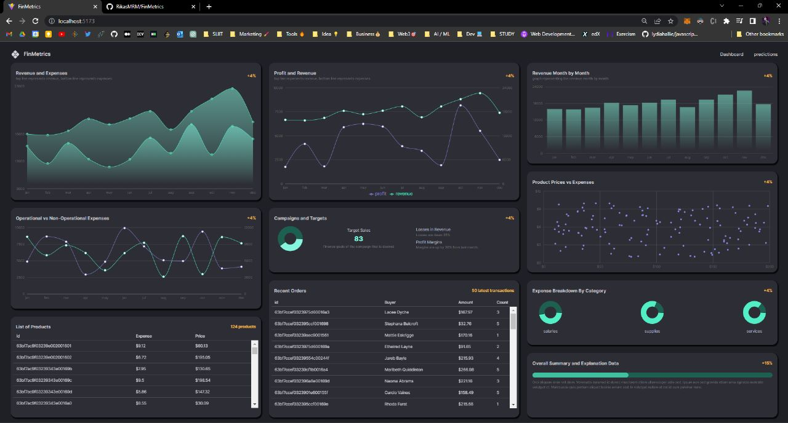
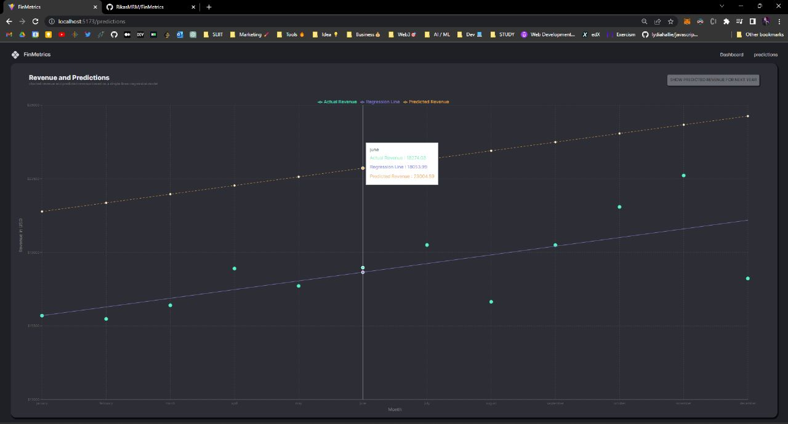

# FinMetrics | A MERN Finance Dashboard App
```Machine Learning, Typescript, React, Node, MUI ```



This application contains 2 main repos, front end and backend in 2 seperate folders names "client" and "server"

## Manual Installation

Navigate into client((Frontend)) folder to install dependancies

```bash
  cd ./client
  npm install
```

Navigate into server((Backend)) folder to install dependancies

```bash
  cd ../server
  npm install
```

## Manual Running the appllication

Open 2 terminal tabs in the both client and server folder

inside the server((Backend)) folder, run;

```bash
npm start
```

inside the client((Frontend)) folder, run;

```bash
npm start
```

## Environment variables 

client - ```.env.local```
```bash
VITE_BASE_URL=http://localhost:....
```

server - ```.env```
```bash
MONGO_URL=''
PORT=
```